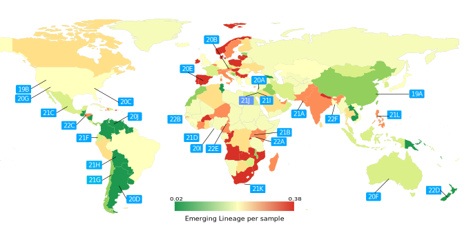

# 2020-2023 SARS-CoV-2 Analysis
A summary of 3 years spread of SARS-CoV-2:

Introduction: 
In nearly 3 years of circulation among the human population, SARS-CoV-2 underwent a complex evolution, shaping its genetics and adaptation to humans. Our study highlights varying prevalence, distribution across regions, and pandemic timeline.

Methodology: In this study we used a dataset of 14,759 SARS-CoV-2 genomes collected between December 2019 and January 2023 from 214 countries. The sequences were analyzed comparatively to explore how SARS-CoV-2 variant mutation patterns varied across time and geographic locations.

Results:
We identified a total of 801 lineages harboring 17,360 nucleic mutations, with an average annual evolution rate of 26.07 substitutions per sample. The lifespan of these variants significantly shortened over time, as dominant virus strains were successively replaced by more adapted variants. SARS-CoV-2 variants' lifespan notably decreased as the pandemic progressed. Dominant virus strains were replaced by more fit variants carrying mutations associated with neutralizing antibodies and potential immune escape. Importantly, we identified a significant proportion of new SARS-CoV-2 variants emerging from developing countries, particularly in sub-Saharan Africa, South America, and South Asia, in spite of the overall homogenization of the SARS-CoV-2 genomic landscape since January 2021.

Conclusions:
Our analysis underscores the dynamic evolution of SARS-CoV-2, with variants rapidly emerging, adapting, and spreading globally, particularly from specific geographic regions of the world which shaped the course of the pandemic.

## Methods
### Data collection
A total of 12,646 SARS-CoV-2 full-length genomes were collected from the GISAID EpiCovTM (update: 15 January 2023) belonging to six geographic areas and distributed over 214 countries [4]. The genomes were obtained from samples collected between December 26, 2019 and January 11, 2023. The sample selection was carefully randomized to ensure a homogeneous distribution of the selected samples across time and location (Supplementary Figure 1). To mitigate potential imbalance arising from variations in the number of samples from each region, all computed ratios were normalized by the number of samples collected from each region. The list of the sequences included in this analysis is provided in Supplementary Table 1.

### Phylogenetic data analysis
The collected sequences were compared to the SARS-CoV-2 reference sequence (Wuhan-Hu-1/2019) using MAFFT and annotated using VCFtools and SnpEff [20-22]. The phylogenetic classification analysis was conducted using the augur pipeline [23]. Samples were interpreted following Nextclade Clades annotation (v2.9.1) and PANGO lineage annotation (cov-lineages.org) [24]. The visualization of phylogenetic plots and the distribution of lineages was performed using auspice (v2.42.0) (github.com/ nextstrain/ auspice.us) [25]. 
The connection between the identified amino acid mutations and clades to their relevant sample’s contextual information was established using GISAID geographical and temporal metadata, and the initial appearance of each mutation was taken into account, as presented in IDbSV database (idbsv.medbiotech-lab.ma) [26].

### Mutational escape
The potential mutational escape of SARS-CoV-2 Omicron variant was estimated using a mutational antigenic profiling of SARS-CoV-2 RBD against a panel of antibodies targeting diverse RBD epitopes from https://jbloomlab.github.io/ dmsvariants/. Deep mutational scanning of RBD targeting antibodies was used to model polyclonal antibody binding to SARS-CoV-2 lineages [27]. All the analyses were performed using R and the code for generating the results can be provided in this github repository: https://github.com/mouneem/2023-SARS-CoV-2.
